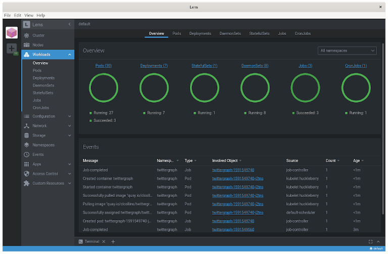
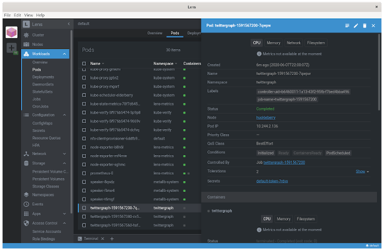
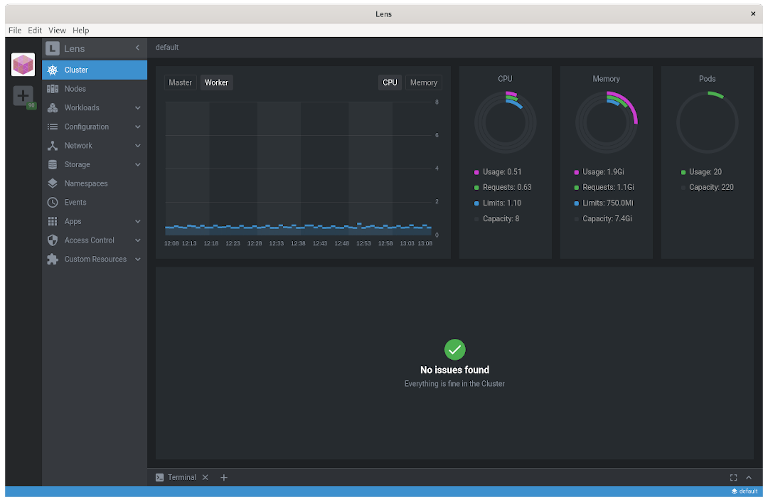

#This repository is archived and will no longer receive updates.

# Manage your Kubernetes cluster with Lens

As more workloads are migrated to containerized environments, it becomes a challenge to manage larger numbers of containers and the connections between them and other systems. As the scale and complexity of a containerized environment increases past the ability of a human to manage, container orchestration platforms, such as Kubernetes, become increasingly important. Such platforms, however, come with their own management challenges, requiring metrics and observability, and a user-friendly interface to present the huge amount of complexity they encompass.

Enter Lens.

Lens, which bills itself as "The Kubernetes IDE", is a useful, attractive, open source UI for working with Kubernetes clusters. Out of the box, Lens can connect to Kubernetes clusters using your kubeconfig file, and will display information about the cluster and the objects it contains. Lens can also connect to - or install itself - a Prometheus stack, and use that to provide metrics about the cluster itself, including node information and health.



To me, the UI is intuitive and easy to use, more so than the Kubernetes' Web UI/dashboard. I even prefer it slightly over OpenShift. Lens is more aesthetically pleasing than OpenShift and laid out more intuitively, though I think more data is immediately available and easier to get with OpenShift. 

Like Kubernetes' dashboard and OpenShift, Lens provides live updates on the state of objects in the cluster and metrics collected by Prometheus.

## Getting Started

Installing Lens is straightforward. There are binaries available for Mac and Windows clients, and Snap and AppImage is available for Linux clients. For this article, we'll download the Lens AppImage to install and use Lens.

According to [docs.appimage.org](https://docs/appimage.org), an AppImage is "a downloadable file for Linux that contains an application and everything the application needs to run". An application packaged as an AppImage is just that - a single executable file that can be downloaded and run.

The AppImage for Lens can be downloaded from the [Lens Github Releases page](https://github.com/lensapp/lens/releases/latest). Once downloaded the file just needs to be marked executable with `chmod`, and then either executed directly or copied to a place in your `$PATH`:

```
# Download the 3.4.0 AppImage for Lens, mark it executable and copy it to your $PATH
# (output omitted for brevity)

$ wget https://github.com/lensapp/lens/releases/download/v3.4.0/Lens-3.4.0.AppImage
$ chmod +x Lens-3.4.0.AppImage
$ sudo mv Lens-3.4.0.AppImage /usr/sbin/lens
```

Lens can then be started just by typing `lens` on the command line.

### Connecting Lens to a Kubernetes cluster

Once launched, Lens can be connected to a Kubernetes cluster by clicking the '+' icon in the top left corner and "selecting a kubeconfig"; a dropdown box will contain any Kubernetes contexts from your `~/.kube/config` file, or you can select a Custom one. Because cluster and authentication information is included about the cluster for any context in the kubeconfig file, Lens treats each context as a different cluster, unfortunately. 

This is particularly unhelpful when paired with how OpenShift creates context information in the kubeconfig file automatically for any Project (NameSpace) you switch to. As an SRE in charge of working on hundreds of clusters, I found dozens and dozens of "clusters" to choose from when setting up Lens.  In practice, I found it best to just select the `default` context for any given cluster. You can manage all namespaces and workloads once Lens has connected, and there's no need to add them all.

Once connected, Lens will display a ton of information about your cluster. You can see workloads that are running; pods and deployments, daemon sets, cron jobs, etc.  You'll also be able to view information about config maps and secrets, networking information, storage, namespaces and events.  Each of these will let you drill down into the information about a given object, and you can even edit the objects directly in Lens.



## Metrics

One of the incredibly helpful features of Lens is its ability to connect to a Prometheus stack installed in your cluster to gather metrics about the cluster and its nodes, both current and historical data. This is great for getting at-a-glance information about the cluster right within the Lens UI, without having to go to an external dashboard. However, the information presented is not comprehensive - it's good for an overview, but you may still wish to utilize a visualization tool such as Grafana with a more complicated dasbhoard to gather more specialized information.

Along with being able to connect to an existing Prometheus stack provisioned in the cluster, Lens can actually install on your behalf, too.  This is very useful for enthusiasts running Kubernetes clusters in their homelabs, deploying and connecting to Prometheus in a single click.

### Installing Prometheus with Lens

If you have been following along with previous articles [building a Kubernetes cluster on Raspberry Pis for your own private-cloud at home](https://opensource.com/article/20/6/kubernetes-raspberry-pi), you will have your own Kubernetes cluster provisioned in your homelab for education and tinkering.  One thing the vanilla cluster is lacking is metrics, and this is a great opportunity to add Prometheus to the cluster and install the [kube-state-metrics](https://github.com/kubernetes/kube-state-metrics) service to gather information about the cluster.

Installation requires only right-clicking on the cluster icon in the top-left corner of the Lens UI (after connecting to the cluster, of course) and selecting "Settings".  On the settings page, under Features you will find a "Metrics" section and a button to install Prometheus. Clicking install will deploy the Prometheus stack to your cluster, and Lens will auto-detect its existence and begin displaying metrics. (It will take a minute - the new Prometheus has to collect some metrics first!)

I also appreciate that Lens links directly to the manifests used to deploy this stack, too, so you can verify what is going to be created before doing so, if you wish.



### Fixing kube-state-metrics

Unfortunately, while Prometheus will install just fine on the Raspberry Pi-based cluster, the kube-state-metrics service will fail. Currently the kube-state-metrics project does not build an aarch64/arm64 image, so pods created from that image will continuously crash with "exec format error" messages in the logs.

Luckily [this issue is being tracked](https://github.com/kubernetes/kube-state-metrics/issues/1037), and the kube-state-metrics project is working toward building the infrastructure needed to produce official ARM images.  Until then, however, we can use a community-developed image and patch the kube-state-metrics deployment directly using Lens.

Going back into the Cluster information, click on "Workloads", and then select "Deployemnts". A list of all the Kubernetes deployment objects in the cluster will appear in the pane to the right. You should be able to pick out the kube-state-metrics deployment easily by the angry red entry under the Conditions column indicating the crashlooping pod issue.

Select the kube-state-metrics deployment and details of the object will slide out from the right in an overlay window. In the upper right corner of this window is a pencil icon. Clicking that icon opens an editor window with the YAML representation of the kube-state-metrics deployment.  Scroll down, and edit the `.spec.template.spec.containers.image` value.  By default this value points to the official image: `quay.io/coreos/kube-state-metrics:v1.9.5`. 

Replace this value with `'docker.io/carlosedp/kube-state-metrics:v1.9.5'`, and click Save.  This will trigger the deployment to roll out new kube-state-metrics pods with an arm64 architecture, and they should become ready and begin reporting the metrics to Prometheus directly.


## Lens lets you see clearly

Kubernetes is complex, and any tool that makes it easier to visualize and work with Kubernetes clusters can lower the barrier of entry for new folks, and make life considerably easier for experienced Kubernetes administrators.  Lens knocks this out of the park with an attractive, intuitive and easy-to-use UI for managing a single or multiple clusters, from the 10,000 foot view down into the nitty-gritty of individual Kubernetes objects. Lens also helps to display metrics about the cluster itself, and makes installing and using a Prometheus stack to display these metrics almost push-button.  I am extremely impressed with Lens and use it to manage several Kubernetes clusters in my own homelab, and I hope you find it useful as well.

Do you have tools you like for managing or visualizing what goes on in your Kubernetes clusters?  Share then in the comments so we can all try them out as well!